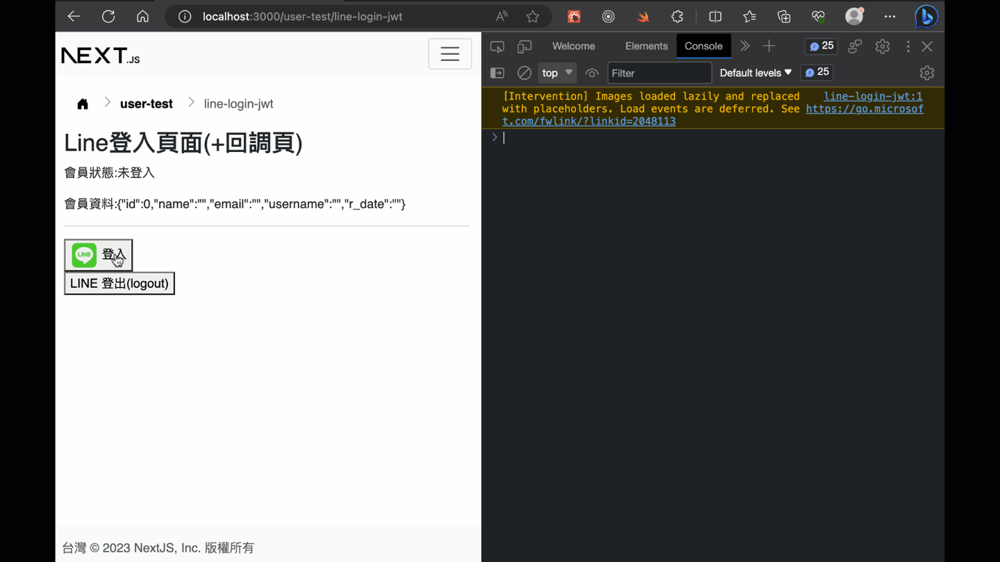

# LINE 登入整合

## 測試畫面



## 預備知識 (!!重要必先了解!!)

1. line登入功能目前在本範例中，只能得到會員名稱和大頭貼圖片，是得不到email的。所以如果你的會員需要用到email，最好你的網站在line登入後，導向這種會員自行再填入email或其它資料。(註: 並不是不加上，而是要從line獲得email，需要另外申請和人工審核。參考[Requesting permission to access the user's email address](https://developers.line.biz/en/docs/line-login/integrate-line-login/#applying-for-email-permission))
2. line登入整合沒有"登出"原本的line的功能(本來就沒有)。目前能作的是要求LINE撤銷通行令牌(revoke access token), 加上登出自己的網站。([revoke access token](https://developers.line.biz/en/docs/line-login/managing-users/#logout))
3. line登入整合沒有彈跳視窗的登入流程(本來就沒有)。
4. line的登入後的存取通行令牌(access token)的設計，有很長的存活期(30天)，和其它的第三方登入的設計不太相同。

### 時序圖 (略過資料庫登入過程)

```mermaid
sequenceDiagram
    autonumber
    React->>+Node: 要求LINE登入網址
    Node-->>+React: 回傳以channel id與secret產生LINE登入網址
    React->>+LINE: 用伺服器生成的登入網址，連至LINE登入頁
    Note over LINE: 會員進行登入
    LINE->>+React: 登入成功，重定向並在網址上加入code與state
    React->>+Node: 將code與state傳送至伺服器callback路由要求登入
    Node-->>React: 登入成功，回應會員資料
  
```

## 準備工作 (!!重要必先了解!!)

### 申請 LINE 開發者channel 

1. 申請網址: [https://developers.line.biz/en/](https://developers.line.biz/en/)
2. 請用 "LINE 帳號" 登入申請，不要用商用帳號的email另外申請。(不然你無法用手機測試登入，就算加入到測試帳號，如果不是line的帳號似乎無法測試)。因為是測試中的channel id，也只有這個申請的LINE帳號能登入而已。
3. callback(回調頁網址)填入值，即你的登入網頁的網址。(目前設計為同一頁)

申請步驟影片: 

[https://youtu.be/7sOIStKkIZk](https://youtu.be/7sOIStKkIZk)

### 伺服器端-資料庫

會員資料表(例如`users`)新增兩個欄位`line_uid`與`line_access_token`:

> 註: `line_access_token`是為了要記錄line給的access token(存取通行令牌)，目前是為了登出機制用。

```sql
ALTER TABLE users
ADD COLUMN line_uid VARCHAR(200) COMMENT '';

ALTER TABLE users
ADD COLUMN line_access_token TEXT COMMENT '';
```

### 伺服器端-環境變數

> 註: 可以參考專案中`.env.template`的範例(以下範例你需要改為自己申請的channel id和secret。注意: 不作其它設定時，預設只有這個申請的LINE開發者帳號能登入)

> 檔案: `.env`

```text
# 注意: LINE_LOGIN_CALLBACK_URL 是前端(react/next)路由
# 必需要與 LINE developer 的 "Callback URL" 設定一致(和登入頁網址一樣)
LINE_CHANNEL_ID=2000376888
LINE_CHANNEL_SECRET=ea6f6a568cf9851292c184e0c9f4abca
LINE_LOGIN_CALLBACK_URL=http://localhost:3000/user-test/line-login-jwt
```

### 伺服器端-套件(1、2步驟都需要)

1。安裝所需套件:

```sh
npm i bluebird secure-compare request debug
```

2。複製`services/line-login.js`到你的專案中，一樣建立`services`資料夾在專案裡。

> 註: 上面這套件是從這個模組專案複製稍微改寫來的: [line-login](https://github.com/nkjm/line-login)，目前是可以正常使用，但它可能需要再進一步改寫來去除多餘的舊套件。它對應的版本是[LINE Login v2.1 API](https://developers.line.biz/en/reference/line-login/)。

### 伺服器 - session

在這範例中的實作會使用session作為安全防範機制，所以要確定你的伺服器中有設定好session。下面的範例是使用檔案的儲存session機制。

> app.js

```js
import session from 'express-session'
// 使用檔案的session store，存在sessions資料夾
import sessionFileStore from 'session-file-store'
const FileStore = sessionFileStore(session)

// ...

// 可以使用的CORS要求，options必要
// app.use(cors())
app.use(
  cors({
    origin: ['http://localhost:3000'],
    methods: ['GET', 'POST', 'PUT', 'DELETE'],
    credentials: true,
  })
)

// ...

// fileStore的選項
const fileStoreOptions = {}
// session-cookie使用
app.use(
  session({
    store: new FileStore(fileStoreOptions), // 使用檔案記錄session
    name: 'SESSION_ID', // cookie名稱，儲存在瀏覽器裡
    secret: '67f71af4602195de2450faeb6f8856c0', // 安全字串，應用一個高安全字串
    cookie: {
      maxAge: 30 * 86400000, // 30 * (24 * 60 * 60 * 1000) = 30 * 86400000 => session保存30天
      // httpOnly: false,
      // sameSite: 'none',
    },
    resave: false,
    saveUninitialized: false,
  })
)
```

> !!特別注意: 如果有使用`nodemon`套件，要設定這個讓它別在有session的檔案產生時，造成重新啟動這會發生安全檢查錯誤，導致無法完成line登入

> package.json

```json
"nodemonConfig": {
    "ignore": [
      "sessions/*",
      "node_modules/*"
    ]
  }
```

## 程式碼解說

### 伺服器 - 登入、登出

> login路由: `routes/line-login.js`

因為透過line給的channel_id與channel_secret，產生登入用的導向連結，所以api的login路由的功能是回傳這個要導向的網址，之後由前台接收後，自己導向瀏覽器視窗到line登入網頁。

這裡透過現成的套件來協助很容易實作:

```js
// 此api路由為產生登入網址，之後前端自己導向line網站進行登入
router.get('/login', LineLogin.authJson())
```

> callback路由: `routes/line-login.js`

使用者由line登入後，會回到同頁面，這時候網址上會多了code和state兩個參數值。前端網頁得到這兩個參數後，會往後端伺服器執行callback路由。

callback路由會再和line伺服器進行一次查詢，才會得到使用者的line相關資料，如果能成功獲得，會像此範例`data/line-login/token-response.json`中的回傳資料。

這裡一樣透過上述的line-login模組來協助進行，寫法和其它的路由寫法有點不同:

> 註: 在這實作中會使用session作為安全機制，所以要確定你的伺服器中有設定好session(上面有說明)

```js
// 此api路由為line登入後，從前端(react/next)callback的對應路由頁面，即真正登入處理路由
// 目前只實作jwt
router.get(
  '/callback',
  LineLogin.callback(
    // 登入成功的回調函式 Success callback
    async (req, res, next, token_response) => {
      console.log(token_response)

      // 以下流程:
      // 1. 先查詢資料庫是否有同line_uid的資料
      // 2-1. 有存在 -> 執行登入工作
      // 2-2. 不存在 -> 建立一個新會員資料(無帳號與密碼)，只有line來的資料 -> 執行登入工作
      const isFound = await count('users', {
        line_uid: token_response.id_token.sub,
      })

      if (isFound) {
        // 有存在 -> 執行登入工作
        const user = await findOne('users', {
          line_uid: token_response.id_token.sub,
        })

        // 如果沒必要，member的password資料不應該，也不需要回應給瀏覽器
        delete user.password

        // 產生存取令牌(access token)，其中包含會員資料
        const accessToken = jsonwebtoken.sign({ ...user }, accessTokenSecret, {
          expiresIn: '24h',
        })

        // 使用httpOnly cookie來讓瀏覽器端儲存access token
        res.cookie('accessToken', accessToken, { httpOnly: true })

        // 傳送access token回應(react可以儲存在state中使用)
        return res.json({
          message: 'success',
          code: '200',
          accessToken,
        })
      } else {
        // 3. 不存在 -> 建立一個新會員資料(無帳號與密碼)，只有line來的資料 -> 執行登入工作
        const newUser = {
          name: token_response.id_token.name,
          email: '',
          line_uid: token_response.id_token.sub,
          line_access_token: token_response.access_token,
          photo_url: token_response.id_token.picture,
        }

        await insertOne('users', newUser)

        const user = await findOne('users', {
          line_uid: token_response.id_token.sub,
        })

        // 如果沒必要，member的password資料不應該，也不需要回應給瀏覽器
        delete user.password

        // 產生存取令牌(access token)，其中包含會員資料
        const accessToken = jsonwebtoken.sign({ ...user }, accessTokenSecret, {
          expiresIn: '24h',
        })

        // 使用httpOnly cookie來讓瀏覽器端儲存access token
        res.cookie('accessToken', accessToken, { httpOnly: true })

        // 傳送access token回應(react可以儲存在state中使用)
        return res.json({
          message: 'success',
          code: '200',
          accessToken,
        })
      }
    },
    // 登入失敗的回調函式 Failure callback
    (req, res, next, error) => {
      console.log('line login fail')

      return res.json({ message: 'fail', error })
    }
  )
)
```

> logout路由: `routes/line-login.js`

清除cookie外，多了一個撤銷(revoke) access token的機制:

```js
// JWT登出機制
router.get('/logout', async function (req, res, next) {
  if (!req.query) {
    return res.json({ message: 'fail' })
  }
  // get access_token from db
  // 有存在 -> 執行登入工作
  const user = await findOne('users', {
    line_uid: req.query.line_uid,
  })

  const line_access_token = user.line_access_token

  // https://developers.line.biz/en/docs/line-login/managing-users/#logout
  // 登出時進行撤銷(revoke) access token
  LineLogin.revoke_access_token(line_access_token)

  // 清除cookie
  res.clearCookie('accessToken', { httpOnly: true })
  // 因登入過程中也用到session，也會產生 SESSION_ID，所以也要清除
  res.clearCookie('SESSION_ID', { httpOnly: true })

  return res.json({ message: 'success', code: '200' })
})
```

### 前端 - 登入、登出

> pages/user-test/line-login-jwt.js

登入有兩段，一是產生登出連結後，自動導向到line頁面去:

```js
// 處理登入
  const goLineLogin = () => {
    // 向後端(express/node)伺服器要求line登入的網址
    axios
      .get('http://localhost:3005/api/line-login/login', {
        withCredentials: true,
      })
      .then((res) => {
        console.log(res.data.url)
        // 重定向到line 登入頁
        if (res.data.url) window.location.href = res.data.url
      })
  }
```

使用者在line畫面登入後，會再導向回同一頁，這時候用useEffect在初次渲染時，獲取router.query中的code和state字串值，往伺服器端送到callback路由進行登入工作，之後登入成功，回傳使用者資料到網頁上:

```js
// 處理line登入後，要向伺服器進行登入動作
  const callbackLineLogin = async (cUrl) => {
    const res = await axios.get(cUrl, {
      withCredentials: true, // 注意: 必要的，儲存 cookie 在瀏覽器中
    })

    console.log(res.data)

    if (res.data.message === 'success') {
      setAuthJWT({
        isAuth: true,
        userData: parseJwt(res.data.accessToken), // jwt use
      })
    } else {
      console.log('login fail or not from login page')
    }
  }

// 從line登入畫面後回調到本頁面用
  useEffect(() => {
    // 水合作用(hydration)保護，以免得不到window全域物件
    if (router.isReady) {
      // 判斷是否有query.code(網址上沒有code是進登入頁的時候)
      if (!router.query.code) return

      const qs = new URLSearchParams({
        ...router.query,
      }).toString()

      const cbUrl = `http://localhost:3005/api/line-login/callback?${qs}`

      // 發送至後端伺服器得到line會員資料
      callbackLineLogin(cbUrl)
    }
    // eslint-disable-next-line
  }, [router.isReady, router.query])
```